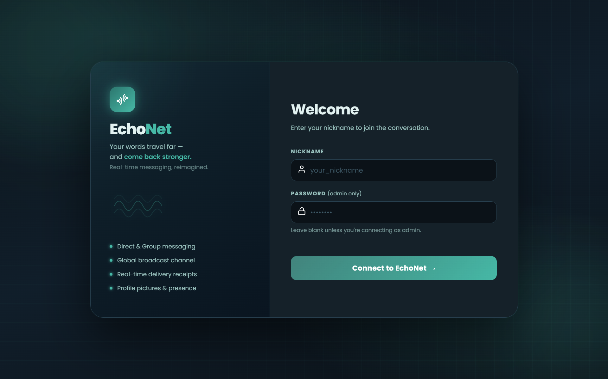
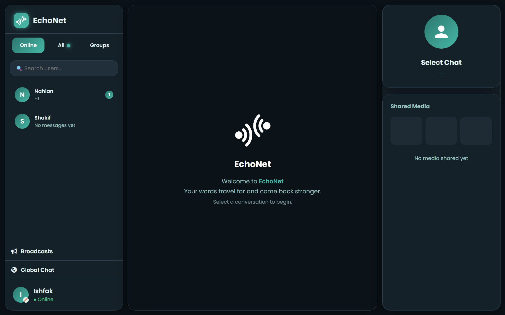
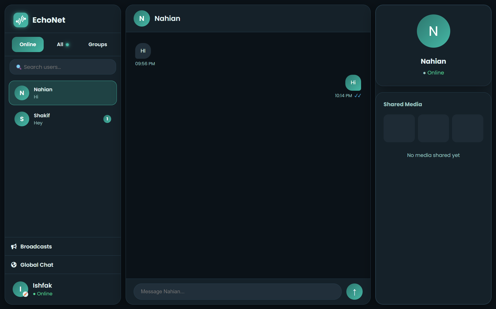
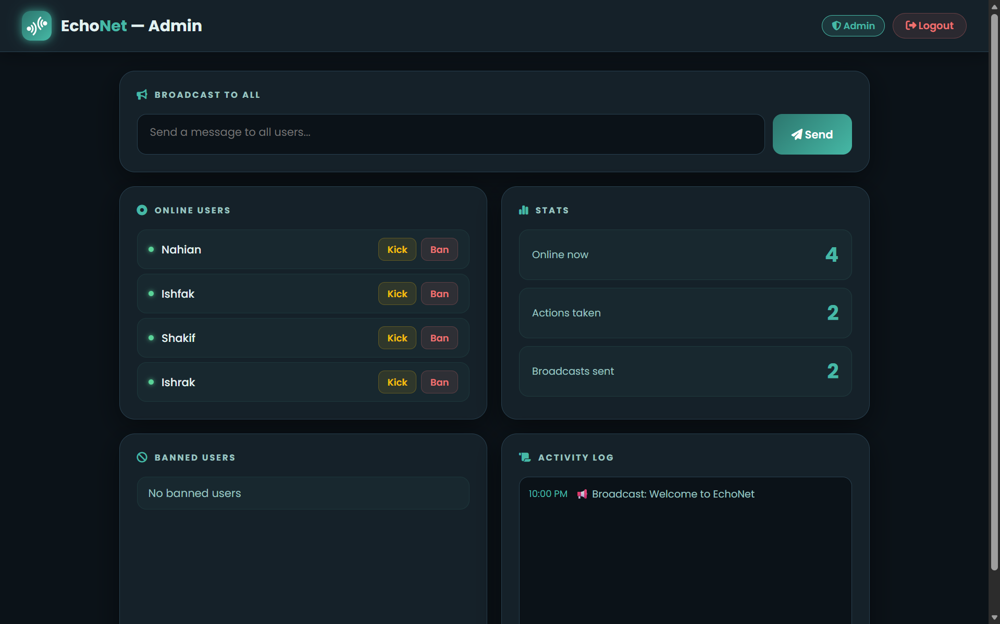
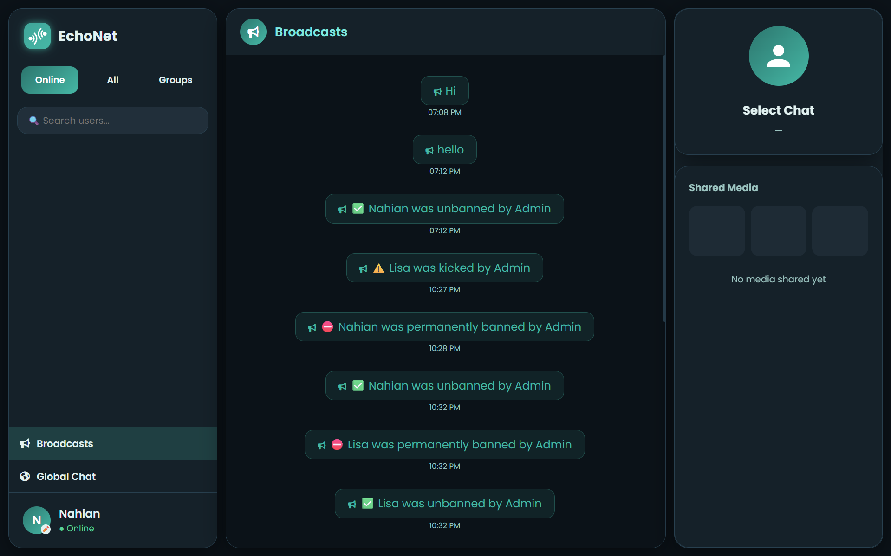
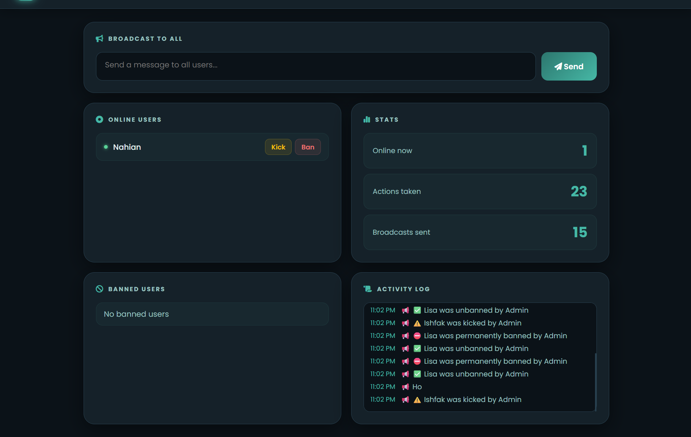
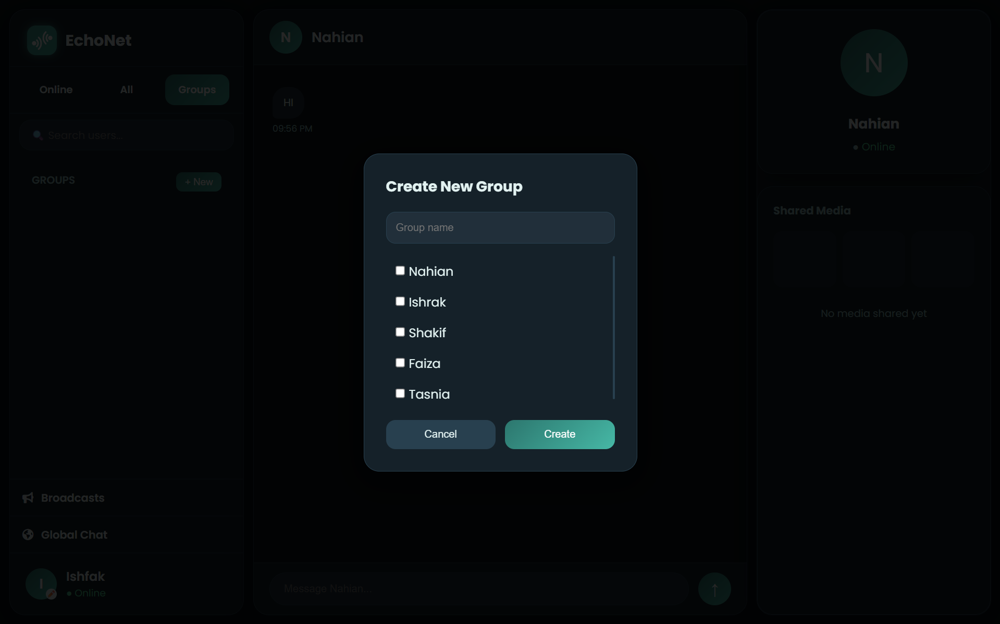
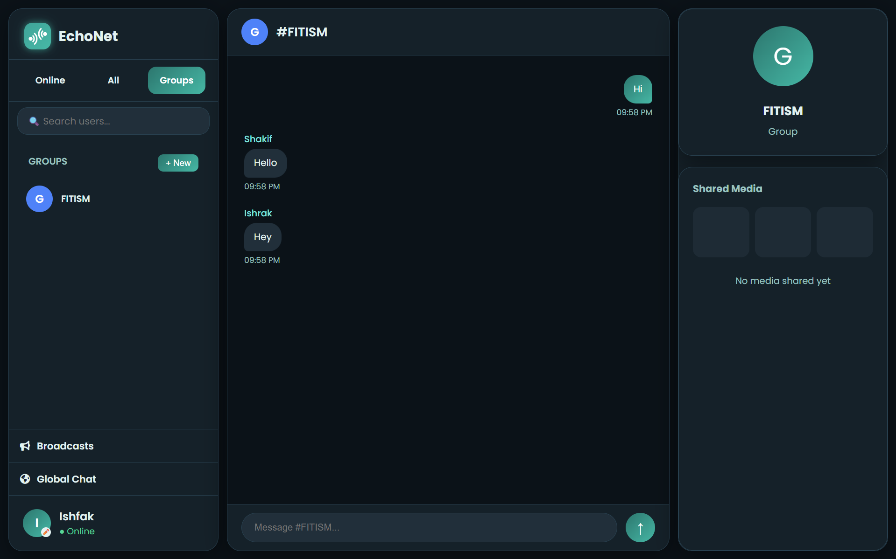
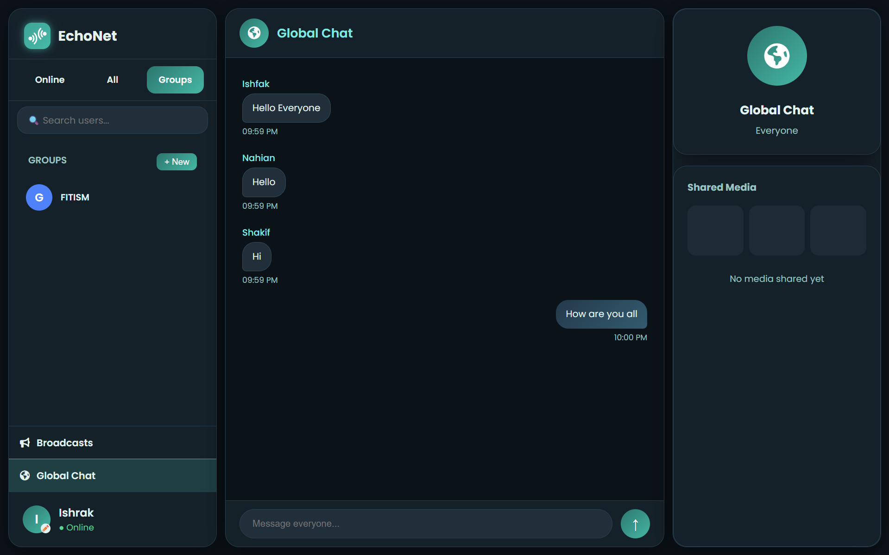

# 🌐 EchoNet

EchoNet is a real-time full-stack chat application built with **Flask, Socket.IO, and JavaScript**, featuring private messaging, group chats, global chat, broadcasts, offline message delivery, and real-time presence tracking.

It is designed as a modern communication system with a multi-panel UI and scalable chat architecture.

---

## ✨ Features

### 💬 Messaging System
- Direct one-to-one private messaging (DM)
- Group chat creation with selectable members
- Global chat for all connected users
- Admin broadcast announcements system

### ⚡ Real-Time Communication
- Flask-SocketIO powered WebSocket communication
- Instant message delivery
- Live online/offline user tracking
- Read receipts (✓ sent / ✓✓ read)

### 👥 User System
- Nickname-based authentication
- Profile picture (DP) upload support
- Online status tracking
- User search functionality (live filtering)

### 📦 Chat Features
- Offline message storage and retrieval
- Unread message counters per user and group
- Last message preview in sidebar
- Chat history loading on reconnect
- Group unread message tracking

### 📢 Broadcast System
- Admin-only broadcast messaging
- Global notification indicator
- Persistent broadcast history (survives reload)
- Kick/ban/unban events broadcast to all users

### 🔐 Admin Panel
- View online users
- Kick users (temporary, can rejoin)
- Ban users (permanent, blocked on reconnect)
- Unban users
- Broadcast messages to all users
- Activity log
- Stats tracking

### 🎨 UI/UX Features
- Modern dark teal theme
- 3-panel layout:
  - Left: Users / Groups / Search / Tabs
  - Center: Chat window
  - Right: Profile & media panel
- Smooth gradients and animations
- Responsive chat bubbles
- Notification dots for unread messages per tab
- Glowing broadcast dot indicator

---

## 🛠️ Tech Stack

### Backend
- Python
- Flask
- Flask-SocketIO
- Custom TCP server (`server.py`)
- SQLite via `database.py`

### Frontend
- HTML5
- CSS3 (custom modern UI)
- Vanilla JavaScript
- Socket.IO client (v4.6.0)
- Font Awesome 6.5.0
- Google Fonts (Poppins)

### File Handling
- Werkzeug (secure file uploads for profile pictures)

---

## 📁 Project Structure

```
EchoNet/
│
├── app.py              # Flask app + Socket.IO bridge
├── server.py           # TCP socket server (core chat logic)
├── database.py         # All database operations
│
├── templates/
│   ├── login.html      # Join / authentication page
│   ├── chat.html       # Main chat UI
│   └── admin.html      # Admin dashboard
│
├── static/
│   └── dp/             # Profile pictures storage
│
├── echonet.db          # SQLite database (auto-created)
└── README.md
```

---

## 🛠️ Installation & Setup

### 1. Clone the repository
```bash
git clone https://github.com/your-username/echonet.git
cd echonet
```

### 2. Install dependencies
```bash
pip install flask flask-socketio eventlet werkzeug
```

### 3. Run the TCP server first
```bash
# Terminal 1 — must be started before app.py
python server.py
```

Wait until you see:
```
Server is listening...
```

### 4. Run the Flask app
```bash
# Terminal 2
python app.py
```

### 5. Open in browser
```
http://127.0.0.1:5000
```

> ⚠️ Always start `server.py` before `app.py`. The Flask app connects to the TCP server on startup — if the TCP server isn't running, users will get a connection error on login.

---

## 🔐 Admin Access

- On the login page, enter `admin` as the nickname
- Enter the admin password in the password field
- Admin is automatically redirected to the admin dashboard
- Admin does not appear in the user list for other users
- Admin can kick, ban, unban users and broadcast messages to everyone

---

## 📡 How It Works

- `server.py` is a raw TCP socket server that handles core chat logic — messaging, groups, bans, kicks
- `app.py` acts as a bridge between the TCP server and the browser via Flask-SocketIO WebSockets
- `database.py` manages all persistent data — users, messages, groups, broadcasts, bans
- Frontend templates communicate with the backend in real time using Socket.IO

---

## 🗄️ Database

The SQLite database (`echonet.db`) is auto-created on first run. It stores:
- Users and online status
- DM and group message history
- Group memberships and read tracking
- Broadcast history
- Banned users

> Deleting `echonet.db` resets all data. Profile pictures in `static/dp/` are unaffected.
---

## 📸 Screenshots

| Login Page | Start Page | Chat Page | 
|-------------------|------------|-------------|
|  |  |  | 

| Admin Page | Broadcast | Admin Page |
|-------------------|------------|-------------|
|  |  |  |

| GroupCreate | Group Chat | Global Chat 
|----------------|------------|-------------|
|  |  |  |

---

## 🎯 Future Improvements

- Message encryption
- Image/file sharing in chat
- Push notifications
- Mobile responsive redesign
- JWT-based authentication
- Better group management (add/remove members)
- Typing indicators

---

## 👨‍💻 Author

Built by **Ishfak Akbar**  
Software Engineering Student

---

## 📜 License
© 2025 Ishfak Akbar. All rights reserved.
